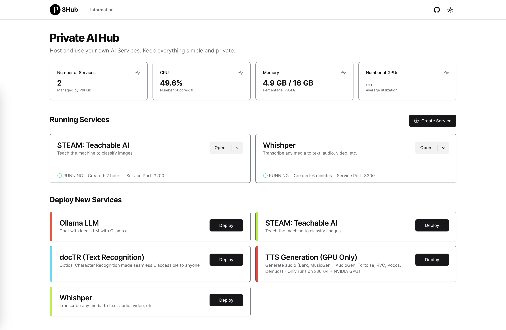

# Private AI Hub (P8Hub)

Host and use your own AI Services. Keep everything simple and private.



## Roadmap

Some features are still in development. You can check the progress here.

- [x] Monitor hardware resources.
- [x] Service management (start, stop/delete).
- [x] Service logs viewer.
- [x] OllamaLLM - General chatbot service.
- [x] Teachable AI - Teach the computer to classify images - STEAM.
- [x] docTR - Document Text Recognition.
- [x] Whishper - Text to speech service.
- [x] TTS Generation (GPU Only)
- [ ] Image generation service.
- [ ] Add documentation.
- [ ] Add tests.
- [ ] Docker extension.
- [ ] App editor.

## I. Installation and Usage

### 1. Installation

- Python 3.9 or higher.
- Install **p8hub**:

```shell
pip install p8hub
```

### 2. Usage

- Run the app:

```shell
python -m p8hub.app
```

or just:

```shell
p8hub
```

- Go to <http://localhost:5678/> to see the user interface.

You can also run Private AI Hub publicly to your network or change the port with parameters. Example:

```shell
p8hub --host 0.0.0.0 --port 8080
```

## II. Development

### 1. Clone the source code

```shell
git clone https://github.com/vietanhdev/p8hub
cd p8hub
```

### 2. Run your backend

- Python 3.9 or higher.
- To install from source, from `p8hub` source code directory, run:

```shell
pip install -e .
```

- Run the app:

```shell
python -m p8hub.app
```

- Go to <http://localhost:5678/> to see the user interface.

### 2. Run your frontend

- Install the dependencies:

```shell
cd frontend
npm install
```

- Run the app:

```shell
npm run dev
```

- Go to <http://localhost:3000/> to see the user interface. Use this address to develop the frontend.

## References

- Next Template: [https://github.com/shadcn-ui/next-template](https://github.com/shadcn-ui/next-template).
- PAutoBot: [https://github.com/nrl-ai/pautobot](https://github.com/nrl-ai/pautobot).
